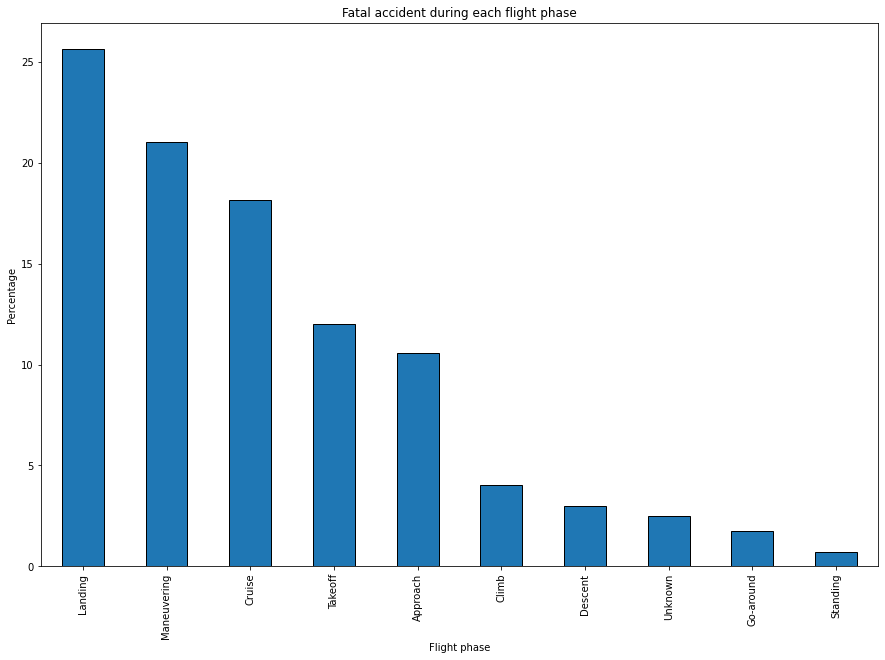
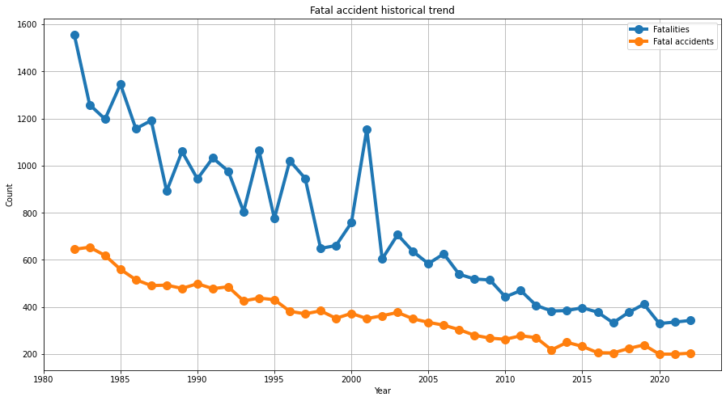
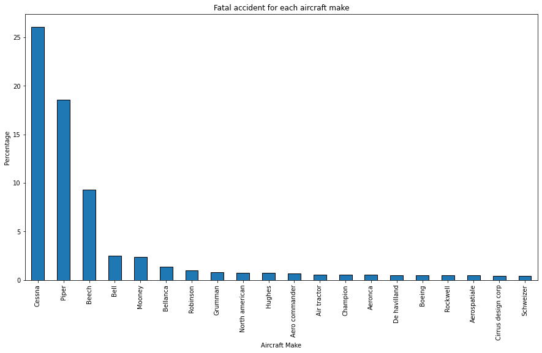

# Risk Assessment for Aircraft Purchase

## Overview
As our company explores new opportunities in the aviation industry, it’s crucial to understand the risks associated with different aircraft. This project will use data science techniques to analyze factors like accident history, maintenance costs, and operational efficiency to provide clear, actionable insights and identify the safest options for the company to start this new business endeavor.

## Business Understanding
Our company is expanding in to new industries to diversify its portfolio. Specifically, the company is interested in purchasing and operating airplanes for commercial and private enterprises, but do not know anything about the potential risks of aircraft. I am charged with determining which aircraft are the lowest risk for the company to start this new business endeavor.
The key business questions are:
1. How do different phases of flight impact the risk levels of aircraft?
2. Over the last few decades, how safe is an airplane?
3. Which airplanes have the highest and lowest accident rates?
4. What is the correlation between the Number of Engines and Injury count?
5. Which aircraft Model has the highest accident count?
6. During which weather conditions did most accidents occur?

## Data Understanding and Analysis
The dataset used for this analysis is a dataset from the [Kaggle National Transport Safety Board](https://www.kaggle.com/datasets/khsamaha/aviation-accident-database-synopses) webiste which is based on records of aviation accidents, which are 88,889 in number and span across 31 columns. Data includes accident dates, locations, injury severity, damage to aircraft, and more.

### Finding from the data analysis
#### Country count
The visualization below shows the number of entries for each of the countries that are available in our dataset

From the visualization above, the United states is the most dominant country in our dataset with over 90% of data, followed by Brazil, Canada, Mexico and United Kingdom.

#### 1. How do different phases of flight impact the risk levels of aircraft?
The visualization below shows how different phases of flight impact the risk levels of aircraft.

From the above visualization: The most common phase during which fatal accidents occur are during Landing (26%), Maneuvering (21%), cruise (18%), takeoff (12%), and approach (10%). Therefore, `Landing` is the most dangerous flight phase.

#### 2. Over the last few decades, how safe is an airplane?
The visualization below was used to answer the question: Over the last few decades, how safe is an airplane?

Both the number of fatalities (blue line) and fatal accidents (orange line) have significantly decreased over the last few decades. This suggests a substantial improvement in aviation safety over time.

#### 3. Which airplane has the highest accident rates?
The Visualization below shows which airplane has the highest accident rates.

From the visualization: The Cessna make has the highest accident rate, as indicated by the tallest bar on the graph. This suggests that Cessna aircraft have experienced the most fatal accidents compared to other makes.

#### 4. What is the correlation between the Number of Engines and Injury count?
The scatterplot below shows the relationship between the Number of Engines and Injury count.

Based on the scatter plot, we note that the Aircraft with fewer engines tend to have higher injury counts, while those with more engines tend to have lower injury counts.

#### 5. Which aircraft Model has the highest Accident count?
The visualization below shows which aircraft Model has the highest Accident count.

The aircraft model 152 has the highest accident count, with just over 2000 accidents. This is significantly higher than any other model listed on the graph.

#### 6. During which weather conditions did most accidents occur?
The visualization below shows during which weather conditions did most accidents occur.

Based on the graph, most accidents occur under Visual Meteorological Conditions (VMC), which might seem counterintuitive as one might expect more accidents in poorer visibility conditions (IMC). This could be due to the higher frequency of flights in VMC compared to IMC.

# Conclusion
- In conclusion, the analysis of NTSB data reveals that while aviation safety has improved over the years, certain flight phases and aircraft models remain more prone to accidents. 
- To enhance safety, the company is recommended to invest in airplanes with advanced navigation and landing technologies, prioritize multi-engine aircraft, diversify training fleets, and implement rigorous pilot training and advanced weather monitoring systems. By adopting these measures, the aviation industry can continue to build on the positive trend towards safer air travel.

# Tableau Visualizations
The following link [Tableau Visualizations](https://public.tableau.com/app/profile/emmanuel.kipngetich6189/viz/Project-04-10-2024-EKC/Dashboard1?publish=yes) is a link to the dashbord that shows the visualizations that were visualized on Tableau workbooks and added to a dashboard.

